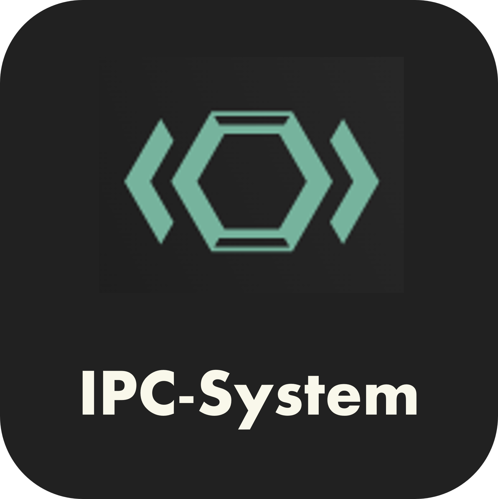

# IPtables Controller Frontend

<p align="center">

</p>

> Author FKT

---

## Setup

### Requirement

- pnpm 8+
- NodeJs 20+
- Vite 4+

### Install Dependencies

```shell
pnpm i
```

### Run dev mode

```shell
pnpm dev
```

### Build

```shell
pnpm build
```

---

## Commands

It is designed to be close to [create-vue](https://github.com/vuejs/create-vue-templates/tree/main/typescript-router-pinia-vitest) commands.

| Command       | Description                                            |
| ------------- | ------------------------------------------------------ |
| dev           | Start devserver.                                       |
| clean         | Clear devserver cache.                                 |
| type-check    | Check vue markup.                                      |
| lint          | Run ESLint and prettier.                               |
| lint:style    | Run Stylelint.                                         |
| test          | Run vitest                                             |
| test:unit     | Run Unit test                                          |
| coverage      | Output Coverage Report.                                |
| build         | Build for production.                                  |
| build:analyze | Execute Bundle Analyzer                                |
| build:clean   | Clear production build files.                          |
| build-only    | Build for production without checking. For Deploy use. |
| preview       | Run the program generated by the production build.     |

---

## Note

This Frontend Project is base on [Vue 3 + Typescript + Vite + Vuetify 3.3](https://github.com/logue/vite-vuetify-ts-starter) Template
